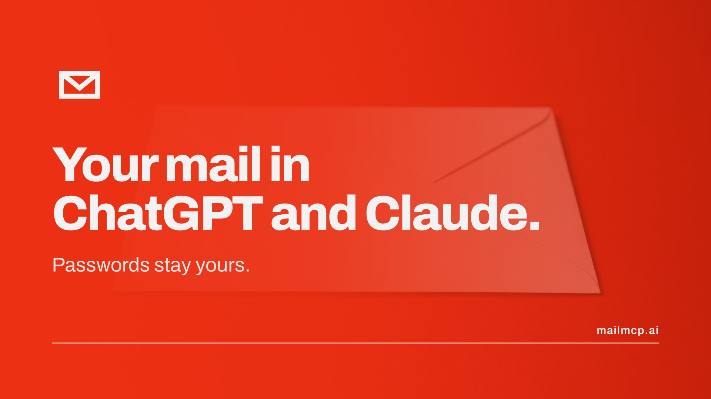
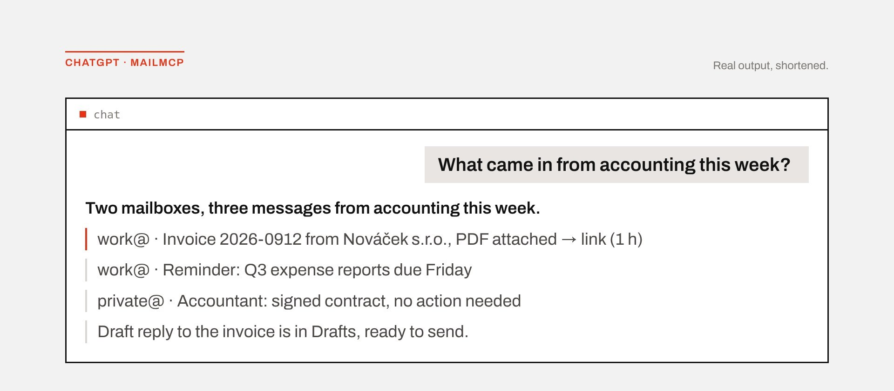
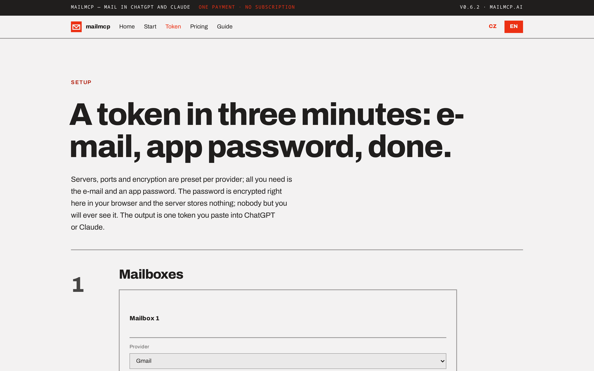

<p align="center">
  <a href="https://mailmcp.ai"></a>
</p>

<h1 align="center">mailmcp</h1>

<p align="center"><strong>All your mailboxes in ChatGPT and Claude. Passwords stay yours.</strong></p>

<p align="center">
  <a href="https://github.com/kojott/mailmcp-dist/releases/latest"></a>
  <a href="https://mailmcp.ai/audit"></a>
  <a href="LICENSE"></a>
  <a href="https://vercel.com/new/clone?repository-url=https%3A%2F%2Fgithub.com%2Fkojott%2Fmailmcp-dist&env=MAILMCP_KEY,MAILMCP_LICENSE,MAILMCP_INVITE_CODE&envDescription=MAILMCP_KEY%3A%2032%20random%20bytes%20as%20base64url.%20MAILMCP_LICENSE%3A%20your%20key%2C%20or%20empty%20for%20the%20free%20tier.%20MAILMCP_INVITE_CODE%3A%20the%20code%20your%20users%20type%20on%20%2Fsetup.&envLink=https%3A%2F%2Fmailmcp.ai%2Fstart&project-name=mailmcp&repository-name=mailmcp"></a>
</p>

mailmcp is a self-hosted MCP server that gives ChatGPT, Claude and other MCP clients access to your e-mail over IMAP and SMTP: several mailboxes at once, any provider, attachments in both directions. This repository is the **prebuilt distribution** (minified bundles in `dist/`, no build step) under a commercial licence; it runs as a free tier without a key, and the source code is available to customers on request.

Ask *"What came in from accounting this week?"* and get one answer across Gmail, iCloud and the company mail server: the invoice as a download link, a reply already drafted.

<p align="center"></p>

## When to use it

Use mailmcp when you have more than one mailbox, a provider without an official connector, or you need attachments. As of September 2026 the official Gmail and Outlook connectors in ChatGPT and Claude handle one mailbox each and cannot send attachments.

| | Official connectors | mailmcp |
| --- | --- | --- |
| Mailboxes | one per connector | several at once, one token |
| Providers | Gmail, Outlook | Gmail, Outlook.com, Microsoft 365, iCloud, Fastmail, Yahoo, Zoho, Seznam.cz and any IMAP/SMTP server with password sign-in, including your own domain |
| Attachments | read some, send none | one-hour download links; sending from the mailbox, from a file the assistant uploads, or by forwarding |
| Authentication | OAuth grant held by the AI vendor | an app password, encrypted in your browser into a token; the server keeps one master key and no database |
| Hosting | the vendor's | yours: Vercel, Docker, any Node 22 host, or Claude Desktop without a server |
| Cost | included in the assistant's plan | free with a signature in sent mail, or one payment (€19 / €149) |

## Quickstart

**Requirements.** Node 22 (or Vercel, or Docker), an HTTPS address (ChatGPT and Claude only connect over HTTPS), and an app password for each mailbox. Gmail: turn on 2-Step Verification first, otherwise Google hides the app-passwords page (organisation policies or Advanced Protection can hide it too). Outlook.com and Microsoft 365 need no password: the user signs in at Microsoft on the setup page (see "Outlook and Microsoft 365" below).

1. **Set an invite code.** A server that issues user tokens must say who may create one, otherwise anyone who knows the address can spend your quota. Pick `MAILMCP_INVITE_CODE` (at least 8 characters) and hand it to the people who may create a token; without it the server issues no tokens and the setup page shows a notice for you. Forgot the code? Read it in your Vercel or Docker environment, or set a new one and redeploy: tokens already issued keep working. A deliberately public server sets `MAILMCP_OPEN_SIGNUP=1` instead.

2. **Deploy.** Click the Vercel button above; it asks for `MAILMCP_KEY` (32 random bytes as base64url, `node -e "console.log(require('crypto').randomBytes(32).toString('base64url'))"`), `MAILMCP_LICENSE` (your key, or empty for the free tier) and the invite code from step 1. Or run it yourself:

   ```bash
   docker build -t mailmcp . && docker run -d -p 8080:8080 \
     -e MAILMCP_KEY=… -e MAILMCP_LICENSE=… -e MAILMCP_INVITE_CODE=… \
     -e MAILMCP_PUBLIC_URL=https://mail.example.com mailmcp
   # without Docker: node dist/node.js with the same variables
   ```

3. **Open `https://<your-server>/start`** and follow it: on the setup page pick the provider, paste the e-mail and the app password, tick what the assistant may do (reading is on by default; drafts are a good second step; sending only with an allowlist of recipients). The page encrypts the password in your browser and hands you one token.

4. **Connect.** ChatGPT → Settings → Apps → Create → URL `https://<your-server>/mcp`; claude.ai → Settings → Connectors → Add custom connector. Sign in with the token. Then ask: *"List my mail accounts."*

<p align="center"></p>

**Try it without deploying.** The shared server at [mailmcp.ai/setup](https://mailmcp.ai/setup) runs this same code; create a token there and connect. The operator of any shared server can technically see your configuration while it serves your requests, which is why companies run their own.

**Claude Desktop, no server.** Download `mailmcp.mcpb` from the [latest release](https://github.com/kojott/mailmcp-dist/releases/latest), open it in Claude Desktop, paste the configuration from `/setup` → "Values for your own deployment".

Behind a reverse proxy set `MAILMCP_PUBLIC_URL` or `MAILMCP_TRUST_PROXY=1`. Company mail servers on private addresses need `MAILMCP_ALLOW_PRIVATE_MAIL_HOSTS=1`. Changing `MAILMCP_KEY` invalidates every token. All variables: [`.env.example`](.env.example).

| Variable | What it does |
| --- | --- |
| `MAILMCP_KEY` | The one master key; seals user tokens and signs OAuth artifacts. Changing it invalidates every token. |
| `MAILMCP_LICENSE` | Your licence key. Empty runs the free tier. |
| `MAILMCP_INVITE_CODE` | Required on a token-issuing server: the code your users type on `/setup`, at least 8 characters. |
| `MAILMCP_OPEN_SIGNUP` | `1` on a deliberately public server, in place of an invite code. |
| `MAILMCP_MS_CLIENT_ID` | Your own Entra app registration id for the Microsoft sign-in. Default: the vendor's public client id. |
| `MAILMCP_MS_REDIRECT` | `1` when this origin is registered as a redirect URI (`https://<host>/api/ms/callback`) in that app: the setup page then signs in through a popup instead of a device code. |
| `MAILMCP_MS_DISABLED` | `1` hides the Microsoft sign-in and answers 404 on every `/api/ms/*` route. |
| `MAILMCP_DISABLE_GRAPH` | `1` refuses Outlook mailboxes at runtime, including in tokens already issued. |
| `MAILMCP_NO_UPDATE_CHECK` | `1` stops the Claude Desktop build from asking GitHub for the latest release on start. |
| `MAILMCP_PUBLIC_URL` | The public address, when the server is behind your own reverse proxy. |
| `MAILMCP_ALLOW_PRIVATE_MAIL_HOSTS` | `1` lets user tokens name mail servers on private addresses. |

## Outlook and Microsoft 365

These mailboxes have no password: Microsoft rejects password sign-in on most accounts. The user picks the provider **Outlook / Microsoft 365** on `/setup` and clicks **Sign in with Microsoft**. On a server whose origin is a registered redirect URI (set `MAILMCP_MS_CLIENT_ID` to your own Entra app and `MAILMCP_MS_REDIRECT=1`) that opens a popup with the account picker; otherwise the page asks whether the user signs in with a personal account (Outlook.com, Hotmail) or a work or school account (Microsoft 365) and shows a short code to type at [microsoft.com/link](https://www.microsoft.com/link) or [login.microsoft.com/device](https://login.microsoft.com/device) respectively. Either way the sign-in sits behind your invite code (the device-code relay requires one even with `MAILMCP_OPEN_SIGNUP=1`), and your users see the app **mailmcp** by Swinging Dogs s.r.o. on the consent screen unless you register your own. No token reaches the vendor: your server runs the sign-in.

What to tell your users: at most **three** Outlook mailboxes per token; the consented Microsoft permissions follow the capabilities they tick (`Mail.Read` for read-only, otherwise `Mail.ReadWrite` and `Mail.Send`), so widening them later needs a new sign-in; a sign-in lasts **about 90 days** (the date is on `/setup` and in `list_accounts` as `reauth_by`, and clients that refresh through our OAuth have it rolled automatically); changing the mailbox password does not end it, revoking the app at Microsoft does, for every token that used that account. Tenants that leave consent to administrators need a one-off approval at `https://login.microsoftonline.com/organizations/adminconsent?client_id=<your client id>`. Mail then flows over Microsoft Graph, so message ids are strings rather than numbers and labels are Outlook categories. Full guide: [mailmcp.ai/docs](https://mailmcp.ai/docs).

### Work accounts on your own server

New Microsoft 365 tenants block sign-in with a code (security defaults, AADSTS530035), so the code flow through the vendor's registration serves personal accounts but often not work accounts. For those, register an app of your own and switch to the popup flow:

1. [Microsoft Entra](https://entra.microsoft.com) → App registrations → New registration; supported account types: **Accounts in any organizational directory and personal Microsoft accounts**.
2. Authentication → add the platform **Mobile and desktop applications** (not Web) with the redirect URI `https://<your host>/api/ms/callback`. mailmcp is a public client with no secret; under the Web platform Microsoft demands one and the sign-in fails with AADSTS7000218.
3. Authentication → **Allow public client flows: Yes**.
4. API permissions → delegated Microsoft Graph `Mail.Read`, `Mail.ReadWrite`, `Mail.Send`, `User.Read`, `offline_access`.
5. Set `MAILMCP_MS_CLIENT_ID=<Application (client) ID>` and `MAILMCP_MS_REDIRECT=1`, redeploy.

Tenants that allow user consent only for verified publishers additionally need publisher verification on your registration (Microsoft AI Cloud Partner Program), or an admin's consent for the whole tenant.

## What the assistant can do

Every tool is gated by the permissions in the token, per mailbox:

| Permission | Tools |
| --- | --- |
| read (default) | `list_accounts`, `list_folders`, `search_messages` (Gmail syntax on Gmail), `get_message`, `get_thread`, `get_attachment` (one-hour download link), ChatGPT `search`/`fetch` |
| draft | `create_draft`, `upload_attachment`, `request_upload` (a one-hour upload link the assistant fills itself) |
| send | `send_message`, `send_draft`, `forward_message`, only to addresses on your allowlist |
| modify | `modify_message` (flags, folders) |
| delete | `trash_message`; nothing is ever deleted permanently |

Every tool is listed to the client; a call the token does not permit fails with an error naming the missing permission.

## Security and data flow

- **Credentials.** The setup page encrypts mailbox passwords in your browser into a split-key token. The server holds one master key, decrypts the configuration only while serving your request, keeps it in memory for at most 15 minutes after the last one, and has no database and no copy of your mail.
- **What leaves the server.** IMAP/SMTP traffic to your mail provider and tool results to your assistant (so the AI vendor sees the results of every tool call, never the passwords). Licence verification is offline. The only links to the vendor are the Buy buttons.
- **Prompt injection.** Message bodies are marked as untrusted data, hidden text is stripped and header fields are sanitized, which reduces the risk of instructions planted in an e-mail; it cannot make a model immune.
- **Protocol.** OAuth 2.1 with PKCE, dynamic client registration and client metadata documents, encrypted tokens with replay guards, login throttling. Read-only defaults, send allowlists, no permanent deletion.
- **Revocation.** Delete the app password at your provider; the token is then useless no matter who holds it. Outlook mailboxes carry a Microsoft refresh token instead of a password: revoke the app at [account.live.com/consent/Manage](https://account.live.com/consent/Manage) or in My Apps for work accounts. Rotating `MAILMCP_KEY` invalidates all tokens on a server.
- **Review.** An internal, AI-assisted security review of version 0.4.1 (September 2026) with every finding, fix and accepted trade-off is public: [mailmcp.ai/audit](https://mailmcp.ai/audit).

## Pricing

| Free | Personal, €19 once | Unlimited, €149 once |
| --- | --- | --- |
| All tools included, up to 2 mailboxes per token (tokens created before 0.7.0 keep 5). Every message the assistant composes (drafts, sends, forwards) ends with "Sent with mailmcp.ai". | One person, up to 5 mailboxes per token, no signature, on your own server or in Claude Desktop. | One server for the whole company, unlimited users and mailboxes. |

All 0.x updates are included; a 1.0 upgrade may carry a fee, and 0.x keeps working. 14-day refund, no questions asked. Company deployment, €990: two hours of online onboarding on your Vercel or cloud, Unlimited licence included. Buy at [mailmcp.ai/pricing](https://mailmcp.ai/pricing): the key appears right after payment and Stripe e-mails the invoice.

## Updating

**Upgrading to 0.8.** Token-mode servers now need `MAILMCP_INVITE_CODE` (at least 8 characters), or `MAILMCP_OPEN_SIGNUP=1` for a deliberately public server. Set one of the two before you deploy 0.8 (Vercel: Settings → Environment Variables → Production, then redeploy), otherwise `/setup` stops issuing tokens and shows a notice for you. Tokens already issued keep working either way; the full list is in `CHANGELOG.md` under 0.8.0. 0.8 also adds Outlook and Microsoft 365 mailboxes through a Microsoft sign-in; nothing has to be configured for that unless you want your own Entra registration or the kill switches above.

Releases are tagged here and listed in [`CHANGELOG.md`](CHANGELOG.md). If you deployed with the Vercel button, Vercel created your own copy of this repository: pull the new tag into it (`git pull https://github.com/kojott/mailmcp-dist.git main` and push), and Vercel deploys the push. Docker and Node: pull, rebuild or restart. To roll back, deploy the previous tag. Your tokens keep working across versions as long as `MAILMCP_KEY` stays the same.

## Questions people ask

**Google says the app-passwords setting "is not available for your account".** Turn on 2-Step Verification and reload; if it is still missing, an organisation policy or Advanced Protection is blocking app passwords.

**I lost my token.** Tokens cannot be recovered. Create a new one on the setup page (with an edit password this time, so you can load and change it later) and swap it in your assistant.

**Can the assistant send mail on its own?** Only if you enabled sending, and only to addresses on the allowlist. Drafts are the safer default.

**Attachment links.** Download and upload links are valid for one hour and carry the token in encrypted form; anyone with the link can use it during that hour.

## Licence, support, reporting problems

The licence agreement is in [`LICENSE`](LICENSE) (English translation first, the Czech original governs): one key, one running installation, no redistribution; removing the licence check or the free-tier signature is prohibited. This is closed-source software, so pull requests are not accepted, but bug reports in [Issues](https://github.com/kojott/mailmcp-dist/issues) are welcome. Security problems: write to info@swingingdogs.com instead of opening an issue. Privacy policy: https://mailmcp.ai/privacy, terms: https://mailmcp.ai/terms.

Guide for people: [mailmcp.ai/docs](https://mailmcp.ai/docs). Guide for assistants, paste the link into ChatGPT or Claude and let it walk you through: [mailmcp.ai/llms.txt](https://mailmcp.ai/llms.txt). Support: [jiridolejs.cz/kontakt](https://jiridolejs.cz/kontakt).

<sub>Version 0.8.0. Made in Prague by <a href="https://jiridolejs.cz">Jiří Dolejš</a>.</sub>
